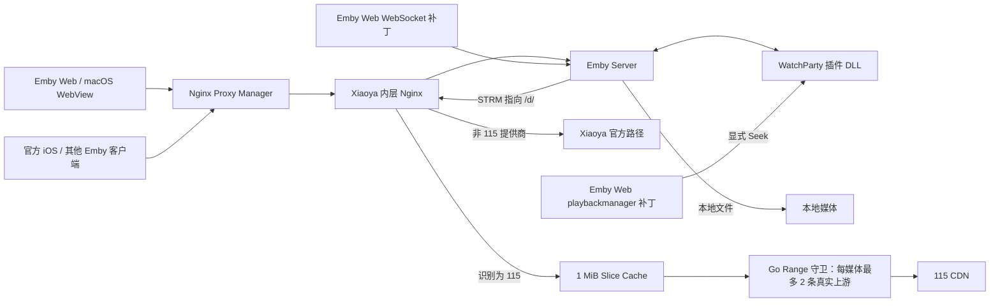

# WatchParty 当前稳定版本工程档案（2026-09-02）

> 状态：已在真实 Web + 官方 iOS 双端场景手工验收，用户评价“接近完美”。
> 稳定标签：`watchparty-stable-20260902`
> 实际功能代码基线：`647a14bf94d8bddc61d3a6c82f84c21e5f043d6e`
> 插件版本：`1.7.14`
> 用途：后续开发、故障诊断、代码审阅、部署恢复和回退时的共同依据。

本文记录的不是一次单点修复，而是从上游 WatchParty 插件逐步演化到当前可用系统的完整工程脉络。它重点回答四件事：为什么要改、曾经怎样改错、现在每一层如何协作，以及未来怎样安全回到这个版本。

本文统一以 `$SERVER_HOME` 表示生产宿主机用户目录，不记录公网域名、IP、令牌、媒体签名地址或个人账号。现有产品需求基线见 [`docs/requirements/watch-party-baseline.md`](../requirements/watch-party-baseline.md)，与原始上游实现的源码对照见 [`docs/research/upstream-watchparty-comparison.md`](../research/upstream-watchparty-comparison.md)。本文不重复逐行代码研究，而记录设计演进、生产事实与运维边界。

## 1. 一句话结论

当前版本把“一起看”从一个按用户粗粒度同步、依赖定时纠偏的插件，改造成了一个以 Emby `SessionId + PlaySessionId` 为身份、Master 单向权威、事件与命令按会话顺序化、能跨字幕/码率/换集重建播放代次，并对 Xiaoya/115 慢链路做短 Range 单飞保护的系统。

最终稳定不是依靠某一个补丁，而是四层共同成立：

1. 插件 DLL 正确管理房间、会话、播放代次、权威时钟和命令确认；
2. Emby Web 补丁明确上报人工 Seek、支持 WebSocket 恢复，并修正 Web 播放选择与 HLS 冷启动；
3. Xiaoya/Nginx 覆盖层稳定 WebSocket、正确解析 STRM、按真实提供商路由 Range；
4. 115 守卫把两个上游名额用于短切片，而不是长期占用或强杀旧播放流。

任何只看其中一层的修复，都曾经造成过“一个问题好转、另一个问题回归”。

## 2. 当前系统边界与架构



### 2.1 各层分别改了什么

| 层 | 当前修改 | 是否进入 DLL | 更新后是否可能丢失 |
|---|---|---:|---:|
| WatchParty 插件 | 房间、Session、播放代次、同步、换集、一键开播、配置页 | 是 | DLL 被替换才会丢失 |
| Emby Web `playbackmanager.js` | 显式 Seek、STRM 输出选择、HLS 冷启动一次性恢复 | 否 | Emby 容器/镜像更新可能覆盖 |
| Emby Web `apiclient.js` / `connectionmanager.js` | WebSocket 退避重连、前台恢复时重建陈旧连接 | 否 | Emby 容器/镜像更新可能覆盖 |
| Xiaoya Nginx / `emby.js` | WebSocket 超时、诊断、缓存版本、STRM 路由和 115 Slice | 否 | `/etc` 会随容器重建；源文件在 `/data`，安装钩子负责恢复 |
| Go `emby-115-guard` | 115 上游 FIFO 双槽、超时、指标与安全校验 | 否 | 二进制保存在 Xiaoya `/data` |
| Nginx Proxy Manager | 外层 WebSocket 长连接与脱敏诊断 | 否 | 配置在 NPM `/data` 持久卷 |
| Homepage | 直达 Emby 内嵌配置页的普通入口 | 否 | 独立 Homepage 配置 |

因此“DLL 和 Emby 都改了吗”的准确答案是：都改了，而且还改了 Xiaoya/Nginx。最后一次提交 `647a14b` 没有再次修改 C#，但它部署在此前已修改的 DLL 之上；该 DLL 的最后一批 C# 变化来自 `23672d5`。`647a14b` 主要收敛了 Emby Web 和 Range 基础设施。

## 3. 必须统一使用的领域概念

后续维护者必须先分清这些概念，否则很容易重走旧路。

### 3.1 User、Session 与播放代次不是一回事

- `UserId`：账号身份。一个账号可以同时打开 Web、iOS、macOS、VidHub 等多个客户端。
- `SessionId`：Emby 当前可观察和可寻址的客户端会话。房间参与者以它为主键，而不是以用户为主键。
- `PlaySessionId`：同一客户端里的一次具体播放实例。Seek、字幕切换、码率切换、重新转码、换集都可能产生新实例。
- 播放代次（generation）：服务端对“当前有效播放实例”的领域表达。旧代次迟到的 Progress/Stop 不得接管新代次。

最典型的历史故障是：Master 在约 33 秒暂停，旧播放器随后上报约 774 秒；若只看 `SessionId`，服务端会把 774 秒当成 Master 权威时钟，再把所有受控端同步到错误位置。Range 连接是否关闭并不能替代播放代次隔离，因为 HTTP 流关闭后，旧播放器对象仍可能继续上报状态。

### 3.2 在线、可控制、在房间也不是一回事

- 在线：Emby Session 仍新鲜，或客户端持续上报播放状态。
- 可远程控制：该 Session 声明并实际具备 Remote Control/视频播放能力，且命令传输可用。
- 在房间：该播放会话已匹配当前房间媒体，并通过当前播放代次校验。
- 休眠参与者：曾在房间，但已 Stop；保留身份以便短暂重连，暂时禁止接收控制。

iOS 打开应用不等于一定存在可控播放会话；显示在线也不等于 WebSocket 控制连接一定可用。配置页现在把这些状态分开展示，不能再合并成一个“在线/离线”布尔值。

### 3.3 STRM、容器和 URL 分属不同层

- `.strm` 是第一层文本指针，不是媒体输出容器。
- `MediaSource.Container` 应来自 Emby 对最终媒体的探测，例如 `mp4` 或 `mkv`。
- `StreamUrl` / `DirectStreamUrl` / `TranscodingUrl` 决定 Web 最终消费的资源。
- `stream.strm` 不能作为 Web 的媒体输出；但也不能因为输入来自 STRM 就强行假设输出一定是 MP4。

这一区分是 2026-08-31 至 2026-09-01 多轮播放回归的核心教训。

### 3.4 Direct Play、Direct Stream 与 Transcode

- Direct Play：客户端直接消费原始容器和编码，不需要 FFmpeg 改写。
- Direct Stream：编码通常不变，但服务器可能换容器或协议。
- Transcode：视频、音频或字幕被 FFmpeg 转换；Web 开 ASS 字幕常需要把字幕烧入 H.264/HLS。

iOS 秒开而 Web 等待数秒通常不是“iOS 调用了服务器硬件转码”。更常见的事实是：iOS 原生播放器能直接解码 HEVC/MKV/字幕，而浏览器不能，Web 只能让服务器运行 FFmpeg。服务器硬件加速可以加快视频编码，但 libass/fontconfig 初始化、远程输入和首个 HLS 分片仍有独立成本。

## 4. 演进过程与心路历程

完整提交列表可以用以下命令查看，Git 历史是逐提交事实源：

```bash
git log --reverse --date=short --format='%ad %h %s' v1.0.0..watchparty-stable-20260902
```

下面按问题域记录关键转折，而不是机械复制每一条提交标题。

### 4.1 第一阶段：从“为房间复制 STRM”回到“绑定原始 Emby 项”

最早为了让插件识别 Xiaoya 媒体，曾尝试为房间生成/刷新独立 STRM、维护目录并处理文件清理。这个方向带来一系列问题：

- 新条目与原媒体的字幕、媒体版本、Artwork、观看记录不天然一致；
- 同一影片多版本时，Web 与 iOS 可能打开不同内部 Item；
- 删除/刷新 STRM 容易误删、漏删或触发额外扫描；
- 剧集换集需要同时维护文件、Emby Item 和房间状态，复杂度成倍增加。

关键转折是 `5785497`：房间只保存并控制原始 Emby Item，不再创建一套影子媒体。后续再用原始 ItemId、系列/季/集身份、`PresentationUniqueKey` 与媒体源信息做同一内容判断。最终原则是：

> 一起看负责“控制哪个 Emby 项和哪个具体媒体源”，不负责制造媒体文件。

这使本地视频和 STRM 共用一套房间模型，媒体播放能力重新交给 Emby。

### 4.2 第二阶段：系列房间从“单集房间”变成真正队列

早期每集切换容易丢房间、丢参与者或被迟到 Stop 清空。为此逐步形成：

- `SeriesPartyQueue` 持久化整个系列的有序普通剧集；
- Master 选集通过 `SeriesSelectionCoordinator` 串行处理；
- 快速连续选集只保留最后一个有效选择；
- `SeriesPlaybackHandoffTracker` 隔离上一集迟到事件；
- 自然播完由 `NaturalEpisodeAdvanceCoordinator` 确认后向 Master 发送下一集 `PlayNow`；
- Master 新集建立后，受控端通过同一房间的 generation-safe 路径跟随；
- 配置页的房间概览可以直接切换当前集。

“给 Master 建一个浏览器播放列表”最终没有作为主方案，因为不同客户端对队列语义实现不一致。当前选择是服务器确认自然结束后推动下一集，控制面更可验证。

### 4.3 第三阶段：从按 User 同步改为按 Session + PlaySession 同步

上游实现按 `UserId` 保存参与者，在“一个账号一个设备”时足够，但同账号 Web+iOS 会互相覆盖。旧 Session 的 Stop 还能删除同用户的新 Session。

当前版本建立了三重隔离：

1. `PartySessionRegistry` 按 `SessionId` 注册参与者；
2. 每个 Session 记录当前 `PlaySessionId`；
3. 同一 Session 同时只能属于一个房间，新房间接管时注销旧房间关系。

`PlaybackGenerationAdoptionPolicy`、`PlaybackGenerationCandidateTracker` 和 `MasterSessionLifecycleCoordinator` 共同判断哪些 Start/Progress/QualityChange/SubtitleChange 可以成为新代次。普通旧 Progress 不具备接管权。

这一步解决了“暂停对得上，恢复却跳回旧位置”“暂停后突然跳到十几分钟”“切集后旧 Stop 把新集踢回主页”等根本问题。

### 4.4 第四阶段：把同步变成 Master 单向权威状态机

曾经存在 Anyone/Host/Vote 等控制语义，观众的 Pause/Unpause 可能反向影响 Master，远程命令回声又可能形成循环。最终产品语义收敛为：

- 只有 Master 的当前有效播放代次能修改房间播放状态；
- 观众的本地暂停/恢复不广播，只会被恢复到 Master 权威状态；
- Master 不在线时，其他客户端自由播放，插件不应锁住它们；
- Master Stop 不再立即向所有观众发送 Stop；
- 观众 Stop 后进入休眠，不接收 Pause/Seek/PlayNow，直到该会话自己的可信 Start/Progress 恢复；
- Master 同集恢复优先在现有播放器中对齐，不滥发 `PlayNow`；跨集才走有界换集路径。

相关决策被拆进 `MasterPlaybackLifecyclePolicy`、`PauseTransitionPolicy`、`PartyPlaybackTransitionCoordinator`、`DormancyAwarePlaybackCommandQueue` 等小模块，而不是继续堆在 `ServerEntryPoint` 事件处理器里。

### 4.5 第五阶段：人工 Seek、暂停精确对齐与延迟学习

只依赖 Emby 普通 Progress 时，服务端无法知道一次位置变化是人工拖动、播放器重载假值，还是旧对象迟到上报。最初用固定容忍度或固定恢复偏移只能掩盖一部分设备，DMIT 多一层链路后会出现 2–3 秒误差。

最终方案分三条路径：

- Web Master：补丁在真正执行 `seek()` 前调用 `POST /WatchParty/Playback/Seek`，携带 Item、Device、Position 和当前 PlaySession；
- 不支持专用事件的 Master：仍可根据可信 Progress 变化做报告驱动校准；
- 受控端：Seek/Pause/Unpause 使用串行队列、确认重试、settle 窗口和命令回声抑制。

暂停与恢复也被拆开：

- 暂停必须在 Master 的确定位置做无偏移对齐，不能因为正常播放容忍度而保留两秒差；
- 恢复播放存在每台设备不同的启动延迟，由 `ParticipantResumeLatencyEstimator` 根据命令时间和后续上报学习，而不是全局写死一个偏移；
- 正常播放中的小漂移保持容忍度，避免每轮都 Seek 导致画面卡顿。

这解释了为什么“容忍度两秒”不等于“暂停也允许差两秒”。

### 4.6 第六阶段：WebSocket 真相、iOS 在线状态与 Firebase 清理

曾经把“Session 消失”“控制未连接”“正在播放却还能同步”混成一个问题。调查后确认：

- 客户端与 Emby Server 本来就维护 WebSocket；插件使用 Emby 的 SessionManager 和现有控制通道；
- 服务端不能凭空主动向一个没有建立传输的 iOS 应用发起反向 WebSocket；
- iOS 正在播放时，Progress HTTP 上报仍可推动同步，即使控制 WebSocket 暂时不可用；
- `PlayNow`、Pause、Seek 等远程控制则需要客户端可寻址且控制通道有效；
- Firebase 在当前部署没有可用配置，也不应作为失败后的假回退，因此从产品路径移除。

“固定二十多秒掉线”的根因之一是 Xiaoya 内层 Emby WebSocket location 继承了 `proxy_read_timeout 20s`。它不是“连接总寿命 20 秒”，而是连续 20 秒没有上游数据就被 Nginx 当作空闲读超时。当前内层和外层代理都使用 24 小时 WebSocket 读/写超时、关闭 buffering、启用 TCP keepalive，并保留不记录 IP、URL、Cookie、Token 的诊断日志。

Web 客户端还补了指数退避重连和前台恢复时的连接重建。这里使用 Emby 原生 WebSocket，不再添加应用层伪 KeepAlive。

### 4.7 第七阶段：配置页从配置表单变成内嵌控制中心

外部控制台最初承担登录、房间管理、媒体选择等功能，但它引入第二个监听器、第二套权限和 API Key，也与 Emby 内嵌页重复。当前已删除 `ExternalWebServer.cs` 及旧 `dashboard/chat/external` 前端资源，Emby 内嵌配置页成为唯一控制中心。

当前页面支持：

- 最近观看和统一搜索，不再要求逐层点媒体库目录；
- 选择具体媒体版本并显示完整 `MediaSource.Path`；
- 配置默认 Master 用户；
- 分开展示房间参与者和所有在线 Session；
- 只对显式勾选且可控的 Session 执行“一键开播”；
- 房间概览直接切集；
- 等待室、房间人数、状态和错误提示采用明确中文；
- 响应式宽度、对齐、键盘操作与浅色主题可读性；
- Homepage 只提供直达这个已认证页面的入口，不再创建第二套控制台。

一键开播的准确语义是：对选中的 Emby Session 发送房间当前确定 Item + MediaSource 的 `PlayNow`。若客户端正在播放其他内容，Emby 的当前播放会被替换，不是叠加第二个音轨。是否能执行取决于该客户端的 Remote Control 能力。

等待室只是在正式开播前的可选门槛：房间启用但未达到 ready 条件时暂停等待。已经正常播放的房间不应再要求“结束等候室”。

### 4.8 第八阶段：STRM/Web 播放错误——最曲折的一段

这一阶段出现过多次“当前没有兼容的流”，也是最值得保留的反例。

#### 错误路线一：把所有 STRM 强制映射成 MP4

动机是 Web 无法直接播放 `stream.strm`，而某些 115 内容实际是 MP4。短期看能修好一个样本，但当 STRM 最终指向 MKV 时，扩展名、MIME 和真实容器冲突，Emby/FFmpeg 会选择错误输出。

最终修复：恢复 Emby 原生 `Container` 探测，只拒绝 URL 自己仍以 `.strm` 结尾的无效 `StreamUrl`。若有合法 `DirectStreamUrl` 就使用；否则让 Emby 构造探测容器对应的 direct stream，或使用服务器给出的 `TranscodingUrl`。不再全局猜 MP4。

#### 错误路线二：把本地/网盘按媒体库名称判断

最初根据“Bangumi 和 Bangumi 电影是本地库”绕过探测，后来发现同一库同时存在本地视频和 STRM，库名不再可靠。

最终修复：第一层真实本地视频路径直接留在 Emby backend；Xiaoya `/d/` 路径才进入提供商解析。`.strm` 可以说明输入是指针，但最终是否走 115 专用守卫由解析出的下载主机决定，不能靠库名或最终 `.mkv/.mp4` 后缀猜。

#### 错误路线三：为了识别媒体额外发送 `Range: bytes=0-0`

多余的 NJS/Emby 预取会占用宝贵的网盘连接，还可能被误认为真实播放 Range。当前删除了冗余的媒体体探测和下一集 `stream.strm` 预取。

仍保留一类窄用途的一字节内部请求：Xiaoya Nginx 向 OpenList `/d/` 解析当前签名重定向，用于识别最终是否属于 115，并立即丢弃响应体。它不由 Emby/FFmpeg 当作媒体流，也不读取云端视频正文。二者不能混为一谈。

#### 错误路线四：把第三条 Range 到来理解为“应该杀掉最旧流”

当时观测到网盘同一媒体可用的真实上游连接有限，于是第三条请求会取消最旧请求再获得名额。这对长 Range 是灾难性的：被截断的往往是 FFmpeg 正在读取的首个 HLS 分片；FFmpeg 将其视为输入失败，重建任务并再次请求，于是形成“第三条来→第一条断→第一条重试→再次抢槽”的风暴。

最终认识是：两条上游限制本身不是为了防止多个进度上报，HTTP Range 也不是播放代次。限制保护的是提供商下载链路；旧进度必须由 `PlaySessionId` 隔离，不能靠杀 HTTP 连接实现。

当前方案：

1. Nginx 把受保护 Range 拆成 1 MiB Slice；
2. 256 MiB 缓存键使用稳定媒体路径哈希 + Slice Range，不包含签名 URL、Token、IP；
3. 同一 Slice 使用 cache lock 单飞；
4. Go 守卫仍按媒体最多允许两个真实上游，但租约只覆盖短 Slice；
5. 额外 Slice FIFO 等待自然释放，绝不取消健康请求；
6. 完整上游请求有 60 秒硬截止，最坏还可能先等待 5 秒租约和 250 ms close grace；
7. Nginx cache lock 为 70 秒，严格大于上述 65.25 秒，避免慢填充期间第二条同 Slice 越过锁；
8. 403 或暂态 503 只做一次刷新签名链接后的有界重试。

#### 另一个 403：签名 URL 与 User-Agent 不一致

115 下载 URL 会绑定解析时的 User-Agent。过去解析请求、Nginx 和 Go 默认 HTTP 客户端使用了不同 User-Agent，导致有效签名在真实 Range 请求时返回 403。当前三段统一为固定非空 User-Agent，并且不把它写入缓存键。

#### Xiaoya 不只有 115

调查中确认 Xiaoya 还可能返回其他网盘提供商。当前 115 专用守卫只接受严格白名单的 115 域名；其他提供商继续走 Xiaoya 官方 `/d/` 路径。不要看到 `.strm` 就默认它一定是 115，也不要把 115 的安全策略扩展到未知主机。

#### 更正（2026-09-03）：限制不是并发连接数，而是瞬时新请求数

本节此前把 115 的限制记为"同一媒体可用的真实上游连接有限"，并据此把房间内媒体强制送回 Emby `@backend`，理由是"让守卫能保护这次读取"。这个理由是循环论证——为了让守卫能保护，才制造了一次服务端读取——而且前提本身是错的。

对生产环境同一个 115 文件的实测：

| 场景 | 结果 |
|---|---|
| 同一瞬间发起 2 个请求 | 2 × `206` |
| 同一瞬间发起 3 个请求 | 2 × `206`，1 × `403` |
| 同一瞬间发起 4 个请求 | 2 × `206`，2 × `403` |
| 5 个请求间隔 500ms 发起 | 5 × `206` |
| 4 个慢速读取器同时持有（启动间隔 700ms） | 4 × `206` |
| 同一链接顺序读 4 次 | 4 × `206` |
| 文件 A 2 并发 + 文件 B 2 并发 | 4 × `206` |

结论：限制是**每个文件每瞬间最多 2 个新请求**，与已经打开的连接数无关，也不跨文件累计。守卫的"最多 2 个切片在途"之所以一直有效，是因为它天然蕴含"最多 2 个瞬时新请求"，而不是因为它限对了并发数。生产指标也印证守卫从未真正受限：`upstream_requests_total` 4163 次，`connection_limit_breaches_total` 0，`slot_wait_timeouts_total` 0，`/d/` 的 403 响应 0 次。

由此得到当前的分层：

1. **njs 只按请求类别路由**，不再查询房间。要原始文件就给直链 302，要服务端生成的 `.m3u8` 就回 `@backend`，本地路径留在原生后端。房间内外一视同仁。
2. **突发只在服务端命令扇出时产生**。参与者同时动作，唯一原因是服务端命令了他们；客户端各自随机开播撞在同一毫秒的概率可以忽略。因此 `ProviderBurstPacer` 在 `DormancyAwarePlaybackCommandQueue` 这个唯一咽喉上，按房间每 400ms 放行 2 条会让客户端新开读取的命令（`PlayNow`/`Resume`/`Seek`）。两人房间零延迟，第三人只等一个窗口。
3. **`Pause`/`Stop` 不排队**：它们结束读取而不是发起读取，延迟它们只会损失同步精度。
4. **守卫仍然保护服务端自己的读取**（转码、字幕烧录），职责收敛到它真正该管的地方。

Seek 不会回到服务端重新取地址——客户端直接对 CDN 发 Range（生产日志核实：一次完整播放中该 item 只被请求 2 次）。所以错开必须做在插件的命令扇出上，njs 层无法覆盖 Seek。

### 4.9 第九阶段：本地 MKV、ASS 字幕和 Web HLS 冷启动

真实日志显示，本地 MKV 根本没有绕到 115：首次播放开启 ASS 字幕后，FFmpeg 在本地打开文件，但 fontconfig/libass 初始化接近 9 秒，首个 HLS 请求约 10 秒后失败；完全相同的第二次任务不到 1 秒即可开始。

当前使用两层修复：

- 每次 Emby 容器启动后，用配置字体做一帧 ASS 预热；以容器 `StartedAt` 为标记，每次启动只运行一次，不创建 WatchParty 播放代次；
- 若 Web 的 `Transcode + .m3u8` 在首启 15 秒内失败，等待 350 ms 后仅重试一次完全相同的 `streamInfo`，因此 HLS URL 和 `PlaySessionId` 不变，不请求新的 PlaybackInfo。

这个恢复严格保留取消语义：原始 `AbortSignal` 会传到第二次 `player.play`；返回、换集、Seek、字幕切换触发的 `AbortError` 不重试；等待中 abort 会保持 Promise rejected；播放器已换成另一个 `streamInfo` 时旧重试静默作废。第二次仍失败才进入 Emby 原生 fallback/NoCompatibleStream。

## 5. 当前插件内部的关键模块

后续维护时优先修改这些小模块和对应测试，不要直接把条件堆回 `ServerEntryPoint.cs`。

| 问题域 | 主要模块 |
|---|---|
| Session 与播放代次 | `PartySessionRegistry`, `PlaybackGenerationAdoptionPolicy`, `PlaybackGenerationCandidateTracker` |
| Master 生命周期 | `MasterSessionLifecycleCoordinator`, `MasterPlaybackLifecyclePolicy`, `MasterSessionSelectionPolicy` |
| 位置与时钟 | `PlaybackSyncCoordinator`, `MasterPlaybackStateDebouncer`, `MasterSeekSourceTracker`, `ParticipantPositionEstimator` |
| Pause/Resume/Seek 确认 | `ConfirmedParticipantPauseSynchronizer`, `ParticipantResumeCoordinator`, `ParticipantResumeLatencyEstimator`, `ConfirmedPlaybackSeekRetrier` |
| 命令顺序与休眠 | `KeyedAsyncSerialQueue`, `DormancyAwarePlaybackCommandQueue`, `ParticipantDormancyTracker` |
| 剧集切换 | `SeriesPartyQueue`, `SeriesSelectionCoordinator`, `SeriesPlaybackHandoffTracker`, `NaturalEpisodeAdvanceCoordinator` |
| 一键开播与 Session 列表 | `PartyLaunchTargetProjector`, `PartySessionDiscovery`, `PartySessionLivenessPolicy`, `PlaybackControlCapabilities` |
| 媒体身份与版本 | `WatchPartyMediaIdentityResolver`, `WatchPartyItemMatcher`, `PlaybackMediaSourceSelector` |
| 配置和权限 | `WatchPartyConfigurationPolicy`, `PluginConfigurationPolicy`, `WatchPartyAuthorizationPolicy` |

## 6. 当前稳定版本的产品语义

### 6.1 房间加入

- 客户端播放房间绑定的同一逻辑 Item/剧集，且播放代次可信时进入房间；
- 同一影片不同内部版本可根据 Emby 身份信息识别，但房间主动开播使用创建时选择的具体 MediaSource；
- 一个物理 Session 同时只能属于一个房间；
- 已停止的旧 Session 不因账号相同而覆盖新 Session。

### 6.2 同步控制

- Master 当前有效代次是唯一权威；
- Pause 时位置精确同步；
- Resume 使用按参与者学习的启动延迟；
- 普通播放约两秒内漂移不反复 Seek；
- 人工 Seek 立即同步，旧 Progress 和远程命令回声不能反向覆盖；
- 配置页一键同步/一键开播只对明确选择的可控 Session 生效。

### 6.3 离开、返回和自由播放

- Master 不在线时，其他客户端不受房间锁定，可以自由暂停和播放；
- 观众离开播放后变成休眠/离房状态，不继续接收命令；
- iOS 回主页不应因为陈旧房间记录仍显示“正在播放”；
- 短暂重连能从可信 Progress 恢复，不要求重建房间。

### 6.4 换集

- Master 手动换集和自然下一集都使用同一 generation-safe 协调器；
- 同集恢复不发不必要的 PlayNow；
- 跨集集换才向可控参与者发有界 PlayNow；
- 上一集迟到 Stop/Progress 不得关闭新集；
- 配置页也可直接改变当前集。

## 7. 已走过的坑：以后不要再这样修

| 不应再做的事 | 为什么错 | 当前替代方案 |
|---|---|---|
| 按 `UserId` 保存唯一参与者 | 同账号多设备互相覆盖 | `SessionId + PlaySessionId` |
| 用关闭 Range 流隔离旧播放实例 | HTTP 连接和播放器代次不是同一概念 | 服务端 generation 校验 |
| 第三条 Range 来时杀最旧流 | 截断 FFmpeg/HLS，触发重试风暴 | 1 MiB Slice + FIFO 双槽 |
| 把所有 STRM 写死为 MP4 | STRM 最终可能是 MKV/其他容器 | 使用 Emby 探测容器和有效 URL |
| 按媒体库名字判断本地/网盘 | 同一库可以混合本地和 STRM | 第一层路径 + Xiaoya 真实解析主机 |
| 为格式判断反复请求 `bytes=0-0` | 占用网盘连接并干扰播放 | 删除冗余媒体探测；只保留内部重定向解析 |
| 固定全局 Resume 偏移 | IPv6、DMIT、设备启动速度不同 | 每参与者在线学习 |
| 把 Pause 容忍度等同播放容忍度 | 暂停后会留下可见时间差 | Pause 无偏移精确对齐 |
| 看到在线就认为可控 | Session 存在不代表 Remote Control/WebSocket 可用 | 在线、可控、在房间分开展示 |
| 服务端“主动连 iOS WebSocket” | NAT/客户端协议不允许服务端凭空反连 | 客户端原生连接 + 代理超时 + 重连 |
| 添加应用层 KeepAlive | 与 Emby 原生机制重叠，可能制造假活动 | 原生 Ping/重连，代理 24h 超时 |
| 重新启用 Firebase | 当前无有效配置，失败回退只会拖慢和混淆 | 完全移除 |
| 让观众 Stop 触发全员 Stop | 容易把正常 iOS 退出变成全房间中断 | 观众休眠，Master 生命周期单独决策 |
| 用宿主机重型 systemd 看门狗守 Xiaoya | 更新机制重复、维护面扩大 | `/data` + XiaoyaKeeper 钩子 + 容器内轻量检查 |
| HLS 失败就重新请求 PlaybackInfo | 会创建新 PlaySession，与 WatchParty generation 竞争 | 同 `streamInfo` 一次性重试 |
| 重试时丢弃 `AbortSignal` | 返回/换集后会复活旧播放器 | 复用 signal，明确跳过 AbortError |

## 8. 部署、持久化与更新行为

### 8.1 DLL

- 宿主机持久路径：`/opt/xiaoya_emby/config/plugins/WatchPartyForEmby.dll`
- 容器路径：`/config/plugins/WatchPartyForEmby.dll`
- 更换 DLL 后需要重启 Emby。

### 8.2 Emby Web 补丁

- Seek/播放补丁源：`tools/patch_emby_watchparty_progress.py`
- 安装器：`tools/install_emby_watchparty_progress_patch.sh`
- WebSocket 补丁源：`tools/patch_emby_websocket_reconnect.py`
- 每次安装会先备份官方文件，再事务性替换并执行幂等验证。
- `data-appversion` 当前为 `4.9.0.42-wp4`，用于强制浏览器获取本稳定版本脚本。
- 当前宿主机 WebSocket 重连补丁 timer 已启用；playback/ASS 补丁 timer 未启用。Emby 镜像更新后应手工运行 playback 安装器或先审查再启用对应机制。

### 8.3 Xiaoya 覆盖层

- 所有源文件保存在 Xiaoya `/data`；
- `/etc/nginx/http.d` 属于容器镜像，重建时会丢失；
- `updateall` wrapper 和 XiaoyaKeeper `mycmd.txt` 钩子在新容器就绪后重新安装窄覆盖；
- 安装前后运行 `nginx -t`，失败时恢复备份；
- 容器内轻量检查确认守卫健康和有效 `nginx -T` 路由；
- 已删除旧的宿主机 `watchparty-xiaoya-overlay.timer`，不再周期性整层覆盖。

### 8.4 外层 Nginx 与 Homepage

- NPM 自定义 HTTP 日志/连接配置保存在其 `/data/nginx/custom/http_top.conf`；
- Homepage 入口在 `$SERVER_HOME/homepage/config/services.yaml`，只链接 Emby 已认证的 `watchpartyconfig` 页面；
- 两者都不是插件 DLL 的一部分。

## 9. 当前线上构件清单与校验值

以下为稳定版本验收时的真实运行值。哈希用于判断以后是否已经偏离该版本。

| 构件 | 来源/位置 | SHA-256 |
|---|---|---|
| 插件 DLL | `/opt/xiaoya_emby/config/plugins/WatchPartyForEmby.dll` | `35a53f32308e30cf57333d3774e64723fe38b946938b02365a91072ca623638b` |
| patched `playbackmanager.js` | Emby `/system/dashboard-ui/modules/common/playback/` | `2f8031693f80f7729ff8f0b743301739df2c58134b8ae9fd974d815384507d6f` |
| patched `apiclient.js` | Emby `/system/dashboard-ui/modules/emby-apiclient/` | `9514aa36b32513f2279299355016de9e83e889a532e7762a1fe02731e40b3b9b` |
| patched `connectionmanager.js` | 同上 | `da80b18c89138b1bc1a65c547719e50762470cbbb3b8938bf2ddcbaee19dc1ad` |
| ARM64 Range 守卫 | Xiaoya `/data/emby-115-guard` | `fd53754260ef47df1cf599e290c562cb816416794e62ab90702b05ffc01d5b4e` |
| Range locations | Xiaoya `/data/emby-115-locations.conf` | `7741440da53e7effc464b8f5491ba1c5ac0bd52130ea9de5efa817db6c4c0f1e` |
| Slice cache zone | Xiaoya `/data/emby-115-throttle.conf` | `94cd73675ea2e48aa397af39d19992ce4424f0560334f78d159a199cc8208a0d` |
| patched Xiaoya `emby.js` | Xiaoya `/etc/nginx/http.d/emby.js` | `7eb445a7e7cd23d51b50035041be5a24d54d83794cf3538ec2dfc515c696e154` |
| Web cache buster | Xiaoya `/data/emby-web-cache-buster.conf` | `67c359fe96b2f7cf6f8a62c3ab2f451141e626c0bb893611133dd11a324ff9d7` |
| WebSocket timeout | Xiaoya `/data/emby-websocket-timeout.conf` | `e894c0a4cf233fb987035c9033cef141a9ae947ed500ad36b4b8b4359d119b1d` |
| 脱敏诊断格式 | Xiaoya/NPM 对应配置 | `c71be509b18b8053309db1ce3b925bb02157205a68f3a7db35ccf98ac8820435` |

验收时镜像 ID：

- Emby：`sha256:f0927b3bc7ec14e6b3d24487d98fcec71e0dc17edbe5627c832c5b411c4d3da7`
- Xiaoya：`sha256:eed7d44538e4f9695b347239b773ef266ffbeba56386166eb171889ce5f45abe`

这些 Web 模块快照只与上述 Emby 镜像兼容。镜像 ID 不同后，不应盲目覆盖旧的 minified JavaScript，而应从新镜像官方文件重新运行 tag 内的幂等 patcher。

## 10. 验收证据

### 10.1 自动化测试

- .NET：334/334 通过；
- 配置页/服务端 JavaScript：65/65 通过；
- Python 部署与补丁测试：48 通过，1 项因本机无 LuaJIT 跳过；
- Go：普通测试和 `-race` 全部通过；
- `git diff --check`、Shell 语法和生产 Nginx 语法通过。

覆盖的关键回归包括：同账号多 Session、旧 Stop/Progress、播放代次接管、Pause 无位置事件、Resume 延迟学习、显式 Seek、命令回声、字幕/码率代次、换集竞态、自然下一集、Session 休眠、一键开播选择、页面布局、STRM 输出选择、Xiaoya 重建恢复、WebSocket 超时、Range FIFO 和同 Slice 单飞。

### 10.2 基础设施实测

- 两条慢下游仍打开时，第三条真实网盘 Seek Range 返回 `206`；
- 下载 1 MiB，耗时约 `1.04 s`；
- 没有终止旧健康响应；
- `replacement / slot_wait_timeout / connection_limit_breach` 均为 `0`；
- 可控慢上游的同 Slice 双请求固定表现为 `MISS → HIT`；
- 两个请求都返回 `206`，模拟上游只收到 1 个请求。

### 10.3 用户手工验收

最终测试覆盖 Web 与官方 iOS、连续房间跳转、暂停、快进、快退、网盘 MKV/MP4 和本地媒体组合。用户确认本轮结果“非常好，情况已经接近完美”。该人工结论是创建稳定标签的直接依据。

## 11. 稳定快照与回退标记

### 11.1 Git 标记

- 稳定 tag：`watchparty-stable-20260902`
- 功能基线提交：`647a14b`
- 上一个较早回退点：`watchparty-pause-sync-20260819`

稳定 tag 指向包含本文的档案提交；该提交相对 `647a14b` 只增加文档，不改变运行代码。因此从功能角度，tag 与当前已部署代码一致。

### 11.2 服务器侧精确构件快照

生产宿主机还保存了不包含 Token、个人配置或媒体地址的只读快照：

```text
$SERVER_HOME/emby/rollback-points/watchparty-stable-20260902/
├── plugin/          # 当前真实 DLL
├── emby-web/        # 三个已补丁 Web 模块
├── xiaoya/          # 守卫、/data 覆盖源和 patched emby.js
├── host-tools/      # 两套 Emby Web patcher/installer 与 ASS fixture
└── MANIFEST.sha256  # 30 个文件的完整校验清单
```

- 快照文件数：30；
- `MANIFEST.sha256` 自身 SHA-256：`97c028d72375150112065b2f4158ae557630dc1216ed433a1364d8a894b529b4`；
- 目录已移除写权限，避免后续部署无意覆盖。

## 12. 回退到本稳定版本

回退前必须先保存“当时的新版本”并确认没有用户正在播放；不要直接覆盖生产文件。

### 12.1 只回退源码

```bash
git fetch --tags origin
git switch --detach watchparty-stable-20260902
```

需要继续开发时，从 tag 新建分支：

```bash
git switch -c recovery/watchparty-stable-20260902
```

### 12.2 回退插件 DLL

在生产宿主机确认快照哈希后，将快照 DLL 复制回插件持久目录并重启 Emby：

```bash
sha256sum -c "$SERVER_HOME/emby/rollback-points/watchparty-stable-20260902/MANIFEST.sha256"
install -m 644 \
  "$SERVER_HOME/emby/rollback-points/watchparty-stable-20260902/plugin/WatchPartyForEmby.dll" \
  /opt/xiaoya_emby/config/plugins/WatchPartyForEmby.dll
docker restart emby
```

实际执行前仍应给被替换 DLL 建一个带时间戳的备份。

### 12.3 回退 Emby Web

若 Emby 镜像仍是本文记录的镜像 ID，可以恢复快照中的三个精确模块。若镜像已经变化，不要复制旧模块；应检出稳定 tag 后，对新镜像官方模块运行两个 installer，让 patcher 做结构兼容检查。

稳定 tag 的推荐方法：

```bash
./tools/install_emby_websocket_reconnect_patch.sh
./tools/install_emby_watchparty_progress_patch.sh
```

安装器会备份原文件、事务性替换并验证二次执行为 `already-patched`。

### 12.4 回退 Xiaoya Range/代理层

从快照的 `xiaoya/` 目录把稳定覆盖文件复制回 Xiaoya `/data`，重新构建或恢复守卫后运行：

```bash
docker exec xiaoya /data/install-emby-115-proxy.sh --reload
docker exec xiaoya nginx -t
docker exec xiaoya curl -fsS http://127.0.0.1:15678/healthz
```

守卫二进制替换后必须让旧进程退出并由 `ensure-emby-115-guard.sh` 启动新二进制；只覆盖磁盘文件不会自动改变已经运行的旧进程。

### 12.5 回退后最低验证

1. Nginx `-t` 通过；
2. 守卫只有一个进程，healthz 为 `ok`；
3. `replacement`、`slot_wait_timeout`、`connection_limit_breach` 没有增长；
4. Emby Web index 显示 `wp4`；
5. `playbackmanager.js` 中 Seek 与 HLS retry marker 各一个；
6. DLL SHA-256 与本文一致；
7. Web + iOS 做一次开播、暂停、恢复、前后 Seek、字幕切换和换集。

## 13. 后续修改的安全工作流

1. 先确认故障属于 DLL、Emby Web、Xiaoya/Nginx、客户端能力还是提供商，不要跨层猜测；
2. 保存故障发生时的 `SessionId + PlaySessionId + ItemId + 时间线`，日志不得记录 Token/签名 URL/IP；
3. 为状态机故障先写确定性单测；为 Nginx/Range 故障使用可控慢源和真实生产语法测试；
4. 不删除现有代次、休眠、命令确认或 FIFO 保护来“简化”；
5. 同步核心已经稳定，除非日志能证明它是根因，否则优先修输入选择或传输层；
6. 修改 Emby Web bundle 时必须同时 bump `data-appversion`；
7. 修改守卫二进制后必须重启守卫进程；
8. 修改 `/data` 配置后同时验证 Xiaoya 重建恢复路径；
9. 完整跑 .NET、Node、Python、Go race 与 Nginx 集成；
10. 真实双端测试通过后再创建下一个稳定 tag 和服务器快照。

## 14. 当前仍然存在的能力边界

- 第三方客户端只有在持续上报时才能作为 Master 时间源；只有实现 Emby Remote Control 的客户端才能做可靠受控端；
- 服务端不能远程拉起一个 Emby 根本看不到、也没有控制通道的客户端；
- 同一浏览器设备的多个标签页是否表现为一个还是多个 Session 由 Emby DeviceId/Session 实现决定，插件无法可靠寻址“某一个 DOM 标签页”；
- Web 对 HEVC、MKV、ASS 的原生支持受浏览器限制，必要时仍会转码；当前修复降低冷启动和错误恢复成本，不会让浏览器突然获得原生解码能力；
- 115 守卫的两条真实上游限制保留；优化点是短切片与单飞，而不是无限提高连接数；
- 非 115 Xiaoya 提供商当前走官方路径，若未来确认也需要连接守卫，应先建立独立证据、主机白名单和测试，不能复用“所有 STRM 都是 115”的假设；
- Emby 镜像更新可能改变 minified Web 模块结构，patcher 会选择拒绝而不是盲目替换；这时需要适配新版本并重新验收。

## 15. 建议后续 AI 使用的技能与阅读顺序

建议技能：

- `diagnosing-bugs`：处理播放、同步、性能或部署回归；
- `codebase-design`：继续拆分 `ServerEntryPoint` 或调整领域边界；
- `tdd`：任何播放时序修复都应先固定失败时间线；
- `code-review`：部署前同时审查规格与工程可靠性；
- `handoff`：跨会话工作时引用本文，不要重新从聊天记录猜历史。

建议阅读顺序：

1. 本文；
2. [`watch-party-baseline.md`](../requirements/watch-party-baseline.md)；
3. [`upstream-watchparty-comparison.md`](../research/upstream-watchparty-comparison.md)；
4. `README.md` 与 `deploy/xiaoya-115-proxy/README.md`；
5. 对应问题域的小模块和测试；
6. 最后才进入 `ServerEntryPoint.cs` 的事件接线层。

## 16. 最终判断

当前稳定版本的价值，不是“所有网络和客户端永远不会失败”，而是主要失败模式已经被放到正确的层处理：

- 身份错乱由 Session/PlaySession 隔离；
- 同步时序由 Master 权威状态机和串行命令处理；
- 设备延迟由学习而不是固定偏移处理；
- Web 能力缺口由窄补丁和原生 fallback 处理；
- 网盘并发由短 Slice、缓存单飞和 FIFO 守卫处理；
- 更新覆盖由持久化源、幂等安装器和就绪钩子处理；
- 回退由 Git tag、服务器精确快照、构件哈希和验收步骤共同保证。

这也是后续维护最重要的原则：先判断问题属于哪个层，再在那个层做最窄、可验证、可回退的修复。
